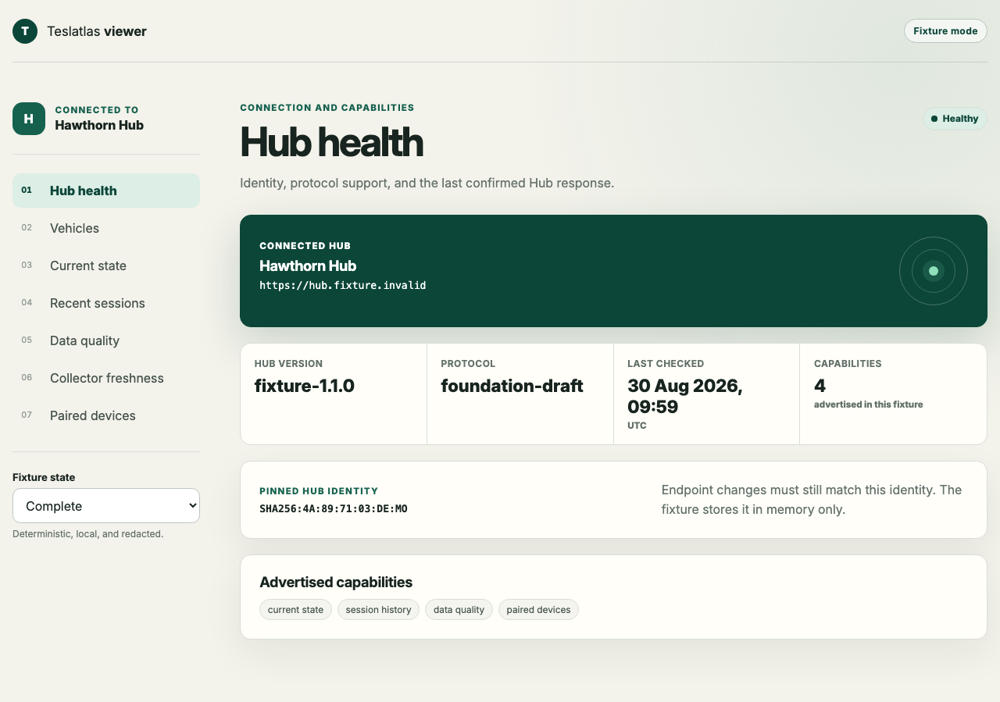
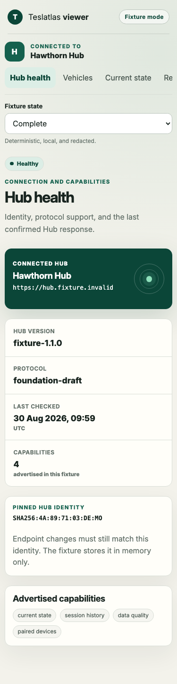

# Teslatlas viewer

Small open-source reference client for Teslatlas Hub.

The current release-cohort product version and its compatibility status are
described in [product versioning](docs/product-versioning.md).

The viewer proves the public client shape without duplicating the proprietary
Teslatlas product. It covers Hub discovery and pairing, health, vehicles,
current state, recent drives and charges, data quality, collector freshness,
and paired-device management.

## Current boundary

The viewer has two explicit modes:

- **Fixture mode:** deterministic, redacted, viewer-owned example data. It
  demonstrates client behaviour without a Tesla account, Hub service, secret,
  or network API call.
- **Live mode:** uses the verified, project-relative `@teslatlas/sdk`
  `2026.36.2` artifact through its public browser export. It accepts an HTTPS
  endpoint, expected Hub UUID, optional invitation TLS identity, and pairing
  invitation. Credentials stay in memory.

`ViewerDataSource` is an internal display seam, not a proposed public SDK API.
The live adapter maps public `hub-http-v1@1.0.0` results without copying the
SDK transport. Charges, quality, collector cost/backup age, and remote device
management remain visibly unsupported because that profile does not expose
them.

## Run locally

Requirements for a source checkout: Node.js 26.0 or later and npm, plus
`tar` for the SDK artifact verifier. The browser and a prebuilt container do
not need Node.js. The locked development toolchain currently runs on Node
26.8.1.

```sh
npm ci --include=dev
npm run dev
```

The default page opens the complete, already-paired fixture. Useful deterministic
states:

```text
/?paired=false
/?scenario=empty
/?scenario=stale
/?scenario=inferred
/?scenario=degraded
/?scenario=offline
/?scenario=error
/?scenario=loading
/?mode=live&paired=false
```

The fixture invitation code is `482731`. It is example data, not a credential.
The home page offers both the labelled fixture demo and the live connection
form; live mode always starts unpaired. Live drive history loads up to 25 rows
per vehicle at a time and exposes an explicit continuation control. Cursors
and credentials remain in memory.

## Run with Docker

The local production image serves the built static Viewer and stores no Hub or
Viewer data. It binds to loopback by default:

```sh
docker compose up --build -d
open http://127.0.0.1:4173/
docker compose down
```

For a standalone image use `docker build -t teslatlas-viewer:local .`. HTTPS
termination and the Hub's exact browser origin/CORS allow-list belong to the
existing deployment. The browser connects directly to the Hub's trusted HTTPS
hostname; a Docker service name is not a browser endpoint.

## Run the installed static viewer

The package exposes `teslatlas-viewer`, a small Node HTTP server for the
packaged production assets. It does not use Vite's development or preview
server at runtime.

```sh
npm run build
npm pack
npm install --prefix ./viewer-install ./teslatlas-viewer-2026.36.2.tgz
./viewer-install/node_modules/.bin/teslatlas-viewer --host 127.0.0.1 --port 4173
```

Use port `0` to request an available port. The command prints the actual bound
HTTP address. `teslatlas-viewer --help` lists the complete bounded interface.

## Verify

```sh
npm run typecheck
npm test -- --run
npm run build
npm run test:cli
npx playwright install chromium
npm run test:e2e
# Requires the Hub-owned disposable target, normal browser trust and private
# owner-only descriptor described in docs/verification.md:
npm run test:e2e:hub
# Against an already serving production Viewer and Hub-owned target:
npm run test:e2e:installed:hub
```

Browser verification covers the seven views, all data states, no fixture API
requests, pairing, confirmed paired-device removal, clearing the local session,
axe checks, keyboard entry, reduced motion, and 400% equivalent reflow. The
The separate managed and installed live lanes exercise the built bundle, packed
SDK, normal CA trust, pairing, bounded drive pagination, conditional requests,
identity failure, session loss, and unsupported-resource boundaries when the
Hub-owned target and browser handoff are available.
Installed-Hub acceptance is tracked separately; fixture and managed synthetic-
Hub evidence do not promote the ecosystem compatibility candidate.

## Screenshots

| Complete desktop | Complete mobile |
| --- | --- |
|  |  |

More captured states are under `output/playwright/screenshots/`.

## Read next

- [Architecture](docs/architecture.md)
- [Protocol learning guide](docs/protocol-learning-guide.md)
- [Public SDK integration roadmap](docs/public-sdk-integration-roadmap.md)
- [Privacy](docs/privacy.md)
- [Browser support](docs/browser-support.md)
- [Foundation plan](docs/plans/2026-08-30-foundation.md)
- [Reference-client implementation plan](docs/superpowers/plans/2026-08-30-reference-client.md)

## Non-goals

No vehicle commands, advanced maps, proprietary analytics, embedded Grafana,
operator console, hosted deployment, or commercial Teslatlas styling.

## Licence

Apache-2.0.
